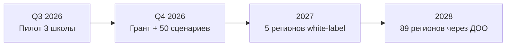

<!-- _class: lead -->

# СПАС

**Карманный AI-помощник первой помощи для подростков 14–17.**

Telegram-бот · 30 сценариев · 0 ₽ для пользователя · open-source

> *Слайд: 30 сек. Говорим: «Каждые 2 минуты в России погибает человек от внезапной остановки сердца. 80 % этих смертей при свидетелях, которые не знают, что делать. СПАС — это секунды, которые мы возвращаем людям.»*

---

## Слайд 2 · Проблема

- 200–300 тыс. внезапных остановок сердца в РФ ежегодно
- Выживаемость в РФ — **5–7 %**, в странах с обученным населением — **50–60 %**
- Урок ОБЖ — 1 час в год, без манекена и AED
- Платные курсы — 4–8 тыс. ₽ — недоступны школьнику

> *Говорим: «Это не сценарий из учебника, это любой школьный коридор, любая дача, любой домашний праздник. Шанс выжить × 10 — если рядом подготовленный подросток.»*

---

## Слайд 3 · Кто пользователь

**17 миллионов подростков 14–24 лет.** Каждый день они рядом с:

- эпилептическими приступами одноклассников;
- падениями старших родственников;
- передозировками на вечеринках;
- удушьем младших братьев и сестёр.

> *«Они хотят помочь — и не знают как. Гугл и YouTube не помогают: первые 4 минуты решают всё.»*

---

## Слайд 4 · Решение — СПАС

| Что внутри                     | Зачем                                       |
|--------------------------------|---------------------------------------------|
| 30 сценариев                   | Все типовые ЧП по российским протоколам     |
| Метроном СЛР 100–120/мин       | Не сбиться с темпа компрессий               |
| Карта АНД (краудсорс)          | Найти ближайший дефибриллятор за 5 секунд   |
| /dispatcher                    | Что говорить оператору 112                  |
| /panic + 4-7-8 + 5-4-3-2-1     | Кнопка «мне страшно» → стабилизация         |
| /sos_share + геолокация        | Отправить SOS-сообщение и место родителю    |

---

## Слайд 5 · Почему Telegram + open-source

- **0 ₽** на установку приложения — Telegram уже у всех 17 млн
- Apache 2.0 (код), CC BY-NC-SA 4.0 (контент) — любой регион форкает за 1 ч
- PWA + REST API — можно встроить виджетом в сайт школы
- GigaChat (Sber AI) — отечественный AI-провайдер, бесплатный пилот-тариф

> *«Мы не строим монополию. Мы строим стандарт первой помощи для всей страны.»*

---

## Слайд 6 · Демо (live, 60 сек)

1. `/sos` → выбор сценария → **СЛР взрослого**
2. pre-test (5 ?) → шаги → 🎵 метроном → post-test (5 ?) → 📜 сертификат
3. `/panic` → 4-7-8 дыхание + 5-4-3-2-1 заземление
4. `/profile` → XP, уровень, ачивки

> *Резерв: GIF-запись на случай плохого Wi-Fi.*

---

## Слайд 7 · Команда и стоимость

- Автор: \[ФИО\], 17 лет, \[Регион\] · 11 класс
- Ментор: \[ФИО\] — врач анестезиолог-реаниматолог
- **MVP-бюджет: 0 ₽** (Fly.io free + GigaChat free + GitHub Pages + Streamlit Cloud)
- Год 1: ~1.07 млн ₽ (контент + врач-валидатор) → закрывается грантом

📊 Финмодель: `docs/finance_model.md` · 🛡 152-ФЗ: `docs/governance_152fz.md`

---

## Слайд 8 · Метрики MVP к маю 2026

- ✅ 30 сценариев + pre/post-тесты
- ✅ Бот, дашборд, лендинг — в проде
- ✅ 70+ unit-тестов · CI зелёный · pre-commit + ruff + JSON-логи
- 🎯 Целевые: 200 пользователей, 500 завершений, NPS ≥ +40, рост компетенции 30 → 80 %

> *Дашборд публичный: cohort retention, NPS-хитмэп, поведенческая воронка.*

---

## Слайд 9 · Дорожная карта (после конкурса)



- Q3 2026: пилот, валидация 5 врачами, PWA-офлайн.
- Q4 2026: грант + интеграция с 112, программа для учителей.
- 2027–28: «Движение Первых» — 89 регионов.

---

<!-- _class: lead -->

## Слайд 10 · CTA

> **«Один сценарий в боте — пять минут жизни ученику.**
> **Десять сценариев — спасённая бабушка.»**

- 🤖 Telegram: **@your_bot_username**
- 📦 GitHub: github.com/your-username/spas-ai
- 🌐 Сайт + PWA: your-username.github.io/spas-ai/
- 📨 Контакт: [email]

**Просим жюри:** пилот в одном регионе на 6 месяцев — покажем рост выживаемости при остановке сердца у свидетелей.

---

## Заготовки ответов на вопросы жюри

См. отдельный файл `pitch_qa.md` (40+ вопросов с короткими ответами).

### Как собрать слайды в PDF

```bash
npx @marp-team/marp-cli@latest docs/jury_deck.md -o docs/jury_deck.pdf
# или PPTX:
npx @marp-team/marp-cli@latest docs/jury_deck.md -o docs/jury_deck.pptx
```
