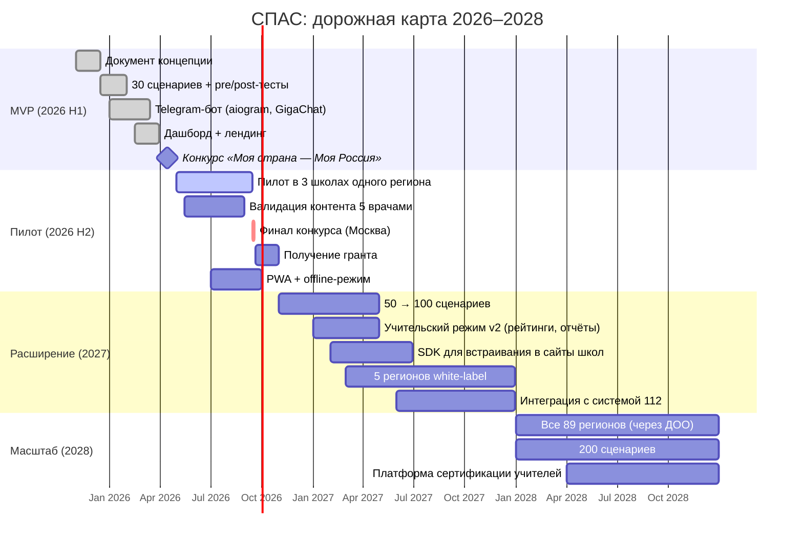

# Дорожная карта СПАС (2026–2028)

## Ключевые ворота (gates)

1. **MVP-готовность (апрель 2026)** — 30 сценариев, бот в проде, лендинг, дашборд. ✅
2. **Пилот-валидация (сентябрь 2026)** — 200+ пользователей, NPS ≥ +40, рост компетенции pre→post ≥ 30 %.
3. **Грант (октябрь 2026)** — финансирование на год 2.
4. **Региональный масштаб (декабрь 2027)** — 5 регионов на white-label.
5. **Системная интеграция (декабрь 2028)** — публикация в реестре отечественного ПО, статус «рекомендовано Минобрнауки» либо «Движение Первых».

## Зависимости и риски

| Зависимость                  | Риск          | Mitigation                                            |
|------------------------------|---------------|-------------------------------------------------------|
| GigaChat API доступность     | средний       | Fallback на статичные ответы; нет vendor lock-in      |
| Telegram-бот платформа       | низкий        | API стабилен; есть план B на ВК-боты                  |
| Доктор-валидатор             | средний       | Заключаем долгосрочный контракт; запасной валидатор   |
| Грант                        | высокий       | Подаёмся в 3+ фонда; backup — краудфандинг            |
| Региональные согласования    | высокий       | Идём через «Движение Первых» как федерального партнёра|
