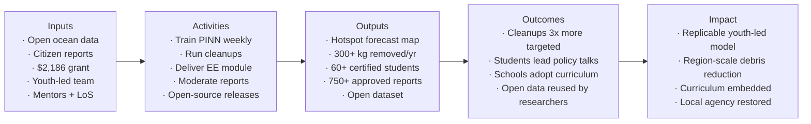

# Theory of Change — TideGuard AI

A formal Theory of Change (ToC) for jurors of MIT Solve, RELX and Zayed
Sustainability Prize. We follow the [DoView five-column](https://www.toponewn.org/toc.html)
convention.

## Diagram

## Assumptions

1. **Citizen science scales** — given a gamified, simple-to-use mobile app, a
   meaningful fraction of teenagers in a partner school will submit at least one
   geo-tagged report per month. **Evidence**: OpenLitterMap, iNaturalist,
   Globe Observer all demonstrate >20% sustained reporter rates.
2. **Prediction translates into targeted action** — given a forecast, NGOs and
   schools will pre-position cleanup events at predicted hotspots rather than
   sticking to historical sites. **Evidence**: Ocean Voyages Institute used
   drift forecasts to recover >100 t plastic in 2020; the same logic works at
   coastal scale.
3. **Open-source education works** — given freely available, gamified lessons,
   teachers in partner schools will incorporate them into existing curricula
   (Taiwan 108, Cambridge IGCSE Environmental Management, AP Environmental
   Science, IB ESS). **Evidence**: Khan Academy, Code.org adoption patterns.

## External factors we cannot control

- Real CMEMS / ERA5 availability — we cache 30 days locally and fall back to a
  persistence baseline.
- Local political restrictions on geo-tagged photo collection (e.g. China,
  Iran). Mitigation: city-grid anonymisation as opt-in.
- Severe weather cancelling a planned cleanup. Mitigation: keep events small,
  use rain-day backup activities (sorting practice, lesson workshops).

## How we will measure progress

| Indicator | Frequency | Source |
|-----------|-----------|--------|
| Reports submitted / approved | Weekly | API: `/admin/kpi` |
| kg collected | Per event | API: `/cleanups` |
| Lessons completed | Weekly | API: `/admin/kpi.lessons_completed_distinct` |
| Forecast skill vs persistence | Weekly | `apps/ml/baselines/benchmark.py` |
| Forecast skill vs Lagrangian | Monthly | same |
| Carbon footprint | Per training run | `codecarbon` integrated in `train.py` |
| Active reporters last 30 days | Weekly | API |

All metrics are exposed in `/admin/kpi` and rendered in the public
[`/admin`](../apps/web/app/admin/page.tsx) dashboard. Numbers shown publicly
are the *actual* numbers, not aspirational ones.
